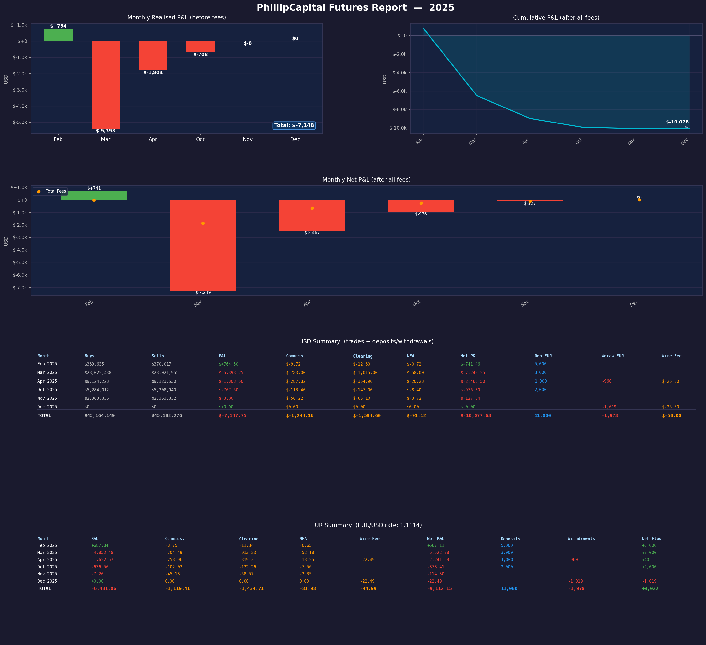

# PhillipCapital Futures Trade Report Parser

Parses PhillipCapital futures trade PDF exports (monthly combined files containing multiple months are supported) and summarizes buy/sell totals, net P&L, and commissions per month.

## Getting Started (First Time Setup)

### 1. Install Python

If you don't have Python installed:

- Go to https://www.python.org/downloads/
- Download and run the installer
- **Important:** Check the box that says **"Add Python to PATH"** during installation
- Click "Install Now"

To verify it worked, open a terminal (Command Prompt or PowerShell on Windows, Terminal on Mac) and type:

```bash
python --version
```

You should see something like `Python 3.12.x`.

### 2. Download this project

Click the green **Code** button on GitHub, then **Download ZIP**. Extract the ZIP to a folder on your computer.

Or if you have Git installed:

```bash
git clone https://github.com/your-username/phillipcapital-report-parser.git
cd phillipcapital-report-parser
```

### 3. Install dependencies

Open a terminal in the project folder and run:

```bash
pip install -r requirements.txt
```

### 4. Run the parser

1. Place your combined monthly PDF export(s) in the project folder.
2. Run the script:
   ```bash
   python parser.py
   ```

The script will automatically find PDF files in the current directory:

- **1 PDF found** — uses it automatically
- **Multiple PDFs found** — shows a numbered list for you to pick from
- **No PDFs found** — prompts you to enter a file path or directory

## Output

### PNG Dashboard Report

The script generates a visual dashboard saved as `phillipcapital_report_<year>.png`:



The report includes:
- **Monthly Realised P&L** bar chart (before fees)
- **Cumulative P&L** line chart (after all fees)
- **Monthly Net P&L** waterfall (after all fees, with fee markers)
- **USD Summary** table with buys, sells, P&L, all fees, deposits, and withdrawals
- **EUR Summary** table with all USD amounts converted using the derived EUR/USD rate

### Console Output

The script also prints detailed tables to the console:

- **Per-Contract Breakdown** — buys/sells per contract symbol (MNQ, MES, M2K, etc.) with correct multiplier applied
- **USD Summary** — per-month buys, sells, calculated P&L, PDF P&L (cross-check), commission, clearing fees, NFA fees, net P&L
- **Deposits & Withdrawals** — WIRE RECEIVED (EUR), WIRE SENT (EUR), wire fees (USD), net flow
- **EUR Summary** — all USD amounts converted to EUR at the derived (or user-specified) exchange rate

### EUR/USD Rate

The script automatically derives the EUR/USD rate from deposit data in the PDF (pairing WIRE RECEIVED amounts with their USDE adjustments). You can accept the derived rate or enter a custom one.

## Contract Multipliers

Contract point multipliers are configured in `config.json`. The file ships with these defaults:

| Symbol | Contract | $/Point |
|--------|----------|--------:|
| MNQ | Micro E-mini Nasdaq-100 | $2 |
| MES | Micro E-mini S&P 500 | $5 |
| M2K | Micro E-mini Russell 2000 | $5 |
| MYM | Micro E-mini Dow | $0.50 |
| NQ | E-mini Nasdaq-100 | $20 |
| ES | E-mini S&P 500 | $50 |
| RTY | E-mini Russell 2000 | $50 |
| YM | E-mini Dow | $5 |
| CL | WTI Crude Oil | $1,000 |
| MCL | Micro WTI Crude Oil | $100 |
| GC | Gold (COMEX) | $100 |
| MGC | Micro Gold (COMEX) | $10 |

To add a new contract, add its symbol and dollar-per-point multiplier to `config.json`:

```json
{
    "multipliers": {
        "MNQ": 2,
        "MES": 5,
        "NEW_SYMBOL": 50
    }
}
```

The parser will warn you if it encounters a contract symbol not present in `config.json`.

## Notes

- The parser detects month boundaries from `RUN DATE` fields in the PDF.
- Designed for the specific PDF layout exported by PhillipCapital (PVMH combined reports).
- P&L cross-check: the "CALC P&L" column (computed from buys/sells with contract multipliers) is verified against the "PDF P&L" column (extracted from the PDF's Realised P&L lines).
